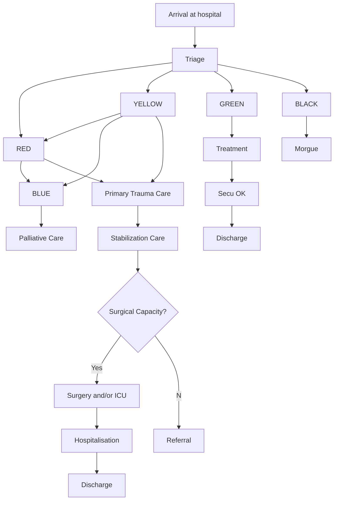

# Patient circuit

```mermaid
graph TD
    ARRIVAL[Arrival at hospital] --> TRIAGE[Triage]
    TRIAGE --> RED[RED]
    TRIAGE --> YELLOW[YELLOW]
    TRIAGE --> GREEN[GREEN]
    TRIAGE --> BLACK[BLACK]
    RED --> BLUE[BLUE]
    YELLOW --> RED
    YELLOW --> BLUE
    BLUE --> ICU[Palliative Care]
    YELLOW --> PTC[Primary Trauma Care]
    RED --> PTC
    PTC --> SC[Stabilization Care]
    SC --> SRGCAP{Surgical Capacity?}
    SRGCAP --Yes--> SRGICU[Surgery and/or ICU]
    SRGICU --> IPD[Hospitalisation]
    IPD --> DIS[Discharge]
    SRGCAP --No--> REF[Referral]
    GREEN --> TREAT[Treatment]
    TREAT --> SECU[Secu OK]
    SECU --> DIS2[Discharge]
    BLACK --> MORGUE[Morgue]

```
alors..
alors..
alors..
alors..
alors..
alors..
alors..
alors..
alors..
alors..
alors..
alors..
alors..
alors..
alors..
