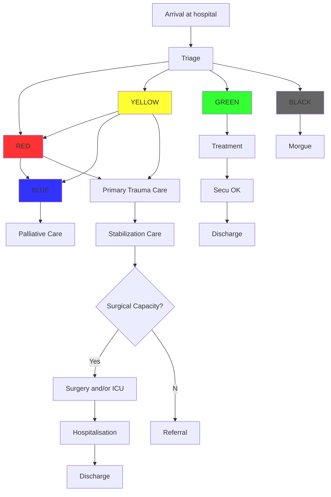

# Patient circuit

## Your hospital patient circuit

||
|--------|
|Must not be too different from the usual circuit|
|Must be clearly indicated (draw lines with paint or use colored tape)|
|Must provide enough space for the ambulances  movements|
|Must foresee additional space if needed|
|Must be tested with a (fake) patient on a stretcher|
|Must be known by all the staff|

